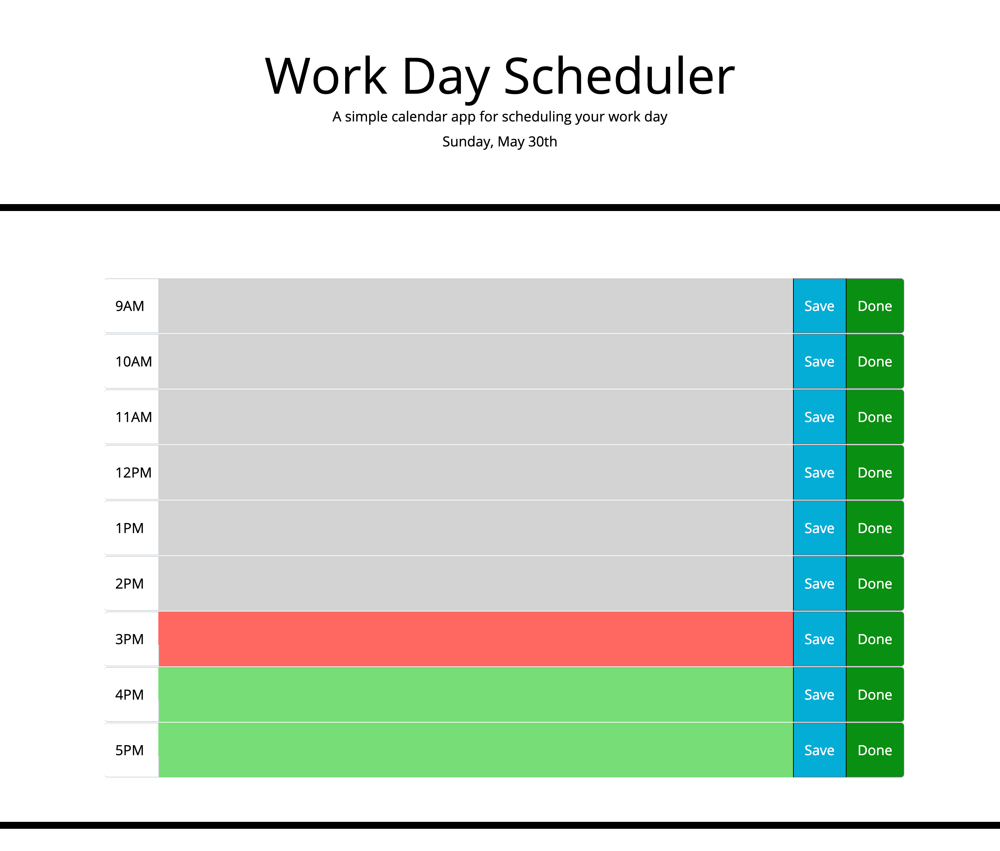

# Work_day_scheduler

This website was designed for its user to schedule events and save them to their local storage.
The site will automatically adapt based on the current time. future time slots will be green, the current
time slot will be red, and the past time slots will be grey. when you write something on a time slot and hit the save button
it will remain on the page even if the page is refreshed;until;the user hits done which will remove the scheduled content from the 
time slot. once a time slot is turned grey any content will be removed from its time slot.

</img>
Deployed site: https://zi-on.github.io/Work_day_scheduler/